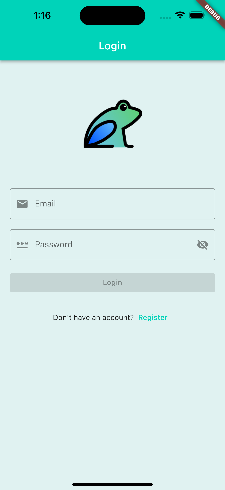
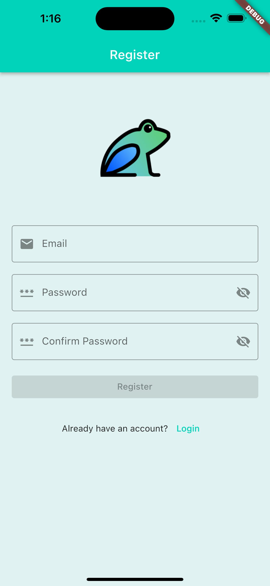
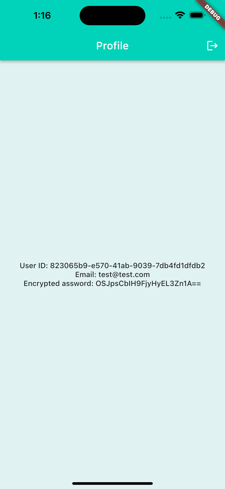

# Dart Frog Playground

[![style: very good analysis][very_good_analysis_badge]][very_good_analysis_link]
[](https://dartfrog.vgv.dev)

[very_good_analysis_badge]: https://img.shields.io/badge/style-very_good_analysis-B22C89.svg
[very_good_analysis_link]: https://pub.dev/packages/very_good_analysis

Full-Stack Dart Application using Flutter, Dart Frog and MongoDB.

## Built With

- [Flutter](https://flutter.dev/)
- [Dart Frog](https://dartfrog.vgv.dev/)

## Features

- Sign up with email and password.
- Sign in with email and password.
- Persisting user sessions with JWT.
- Authorization using JWT.

## Preview

<p align='center'>
    
    
    
    
</p>

## How to run

First, you'll need to clone the repository using the following command in your terminal:

```sh
git clone https://github.com/cem256/dart_frog_playground
```

Next, you'll need to install the dart_frog_cli if you haven't already done. You can do this by running the following command in your terminal:

```sh
dart pub global activate dart_frog_cli
```

Inside the backend folder, you can start the server by using:

```sh
dart_frog dev
```

Finally, you'll need to start the mobile app by running the following command in the mobile folder:

```sh
flutter run
```
